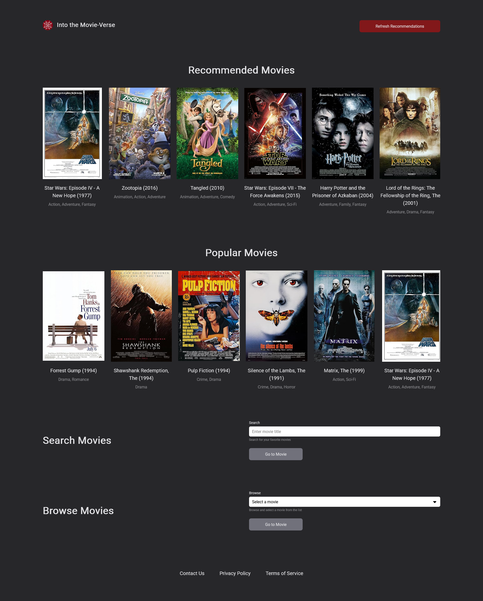
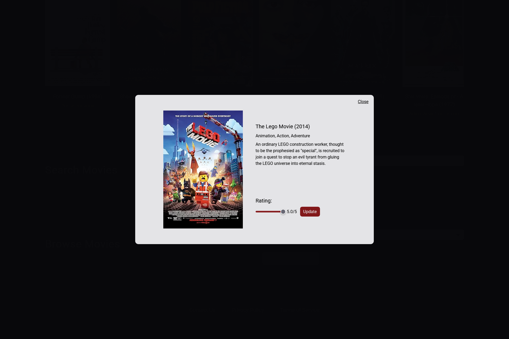
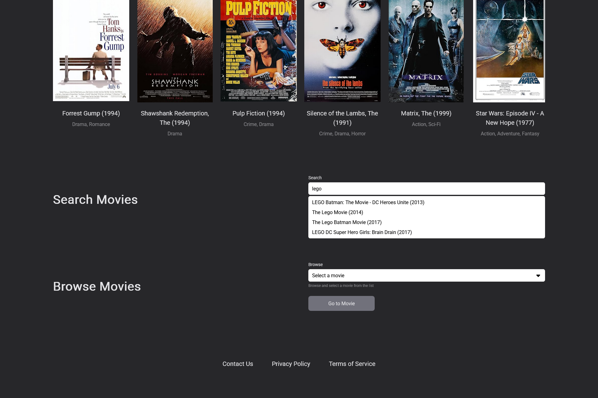
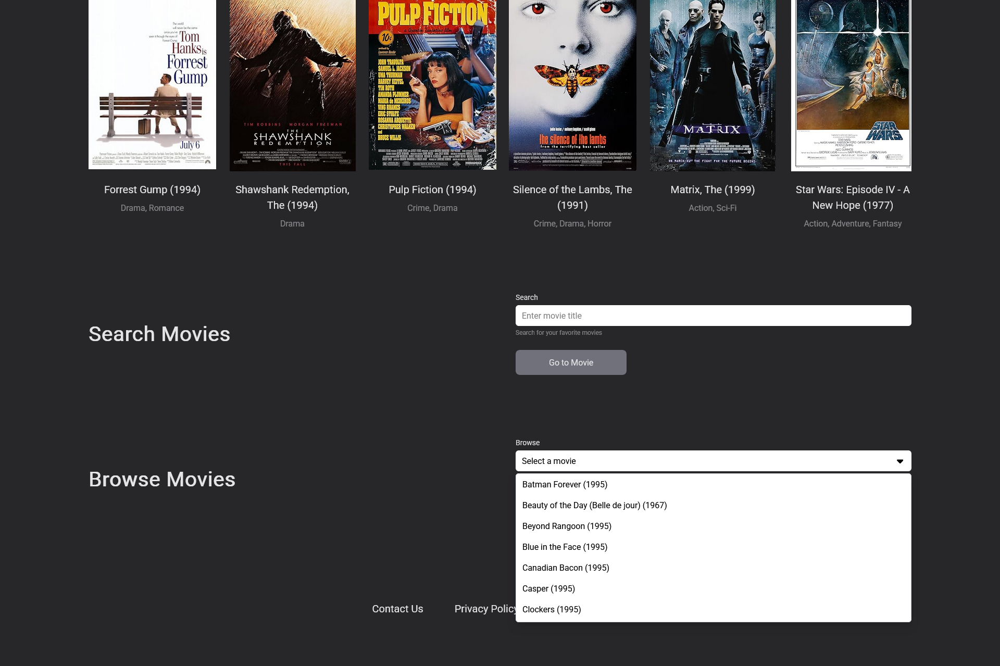

# Into the MovieVerse - Front-End Application
 Movie recommendation system that provides users with movie recommendations based on their rating history and similar users' ratings found in a MovieLens dataset. This front-end application connects to a backend, hosted on pythonanywhere.com, that contains custom API scripts to handle posting new user ratings, getting new movie recommendations, and getting movie details from OMDb.

## Table of contents

- [Overview](#overview)
  - [The challenge](#the-challenge)
  - [Built with](#built-with)
  - [Live Link](#live-link)
  - [Screenshots](#screenshot)

## Overview

### The challenge

Users should be able to:

- View the optimal layout for the app depending on their device's screen size.
- Rate movies within the dataset with values between 0.5 and 5 by:
  - Scrolling through popular movies.
  - Searching movies with search bar filtering.
  - Browsing movies using a dropdown menu.
- See personalized movie recommendations based on the user's rating history.

### Built with

- Semantic HTML5 markup
- Mobile-first workflow
- TypeScript
- [React](https://reactjs.org/) - JS library
- [Tailwind CSS](https://tailwindcss.com/) - For styles

### Live Link
- Live Site URL: [Into the MovieVerse](https://mjclaypool.github.io/Into-The-MovieVerse/)

### Screenshots

